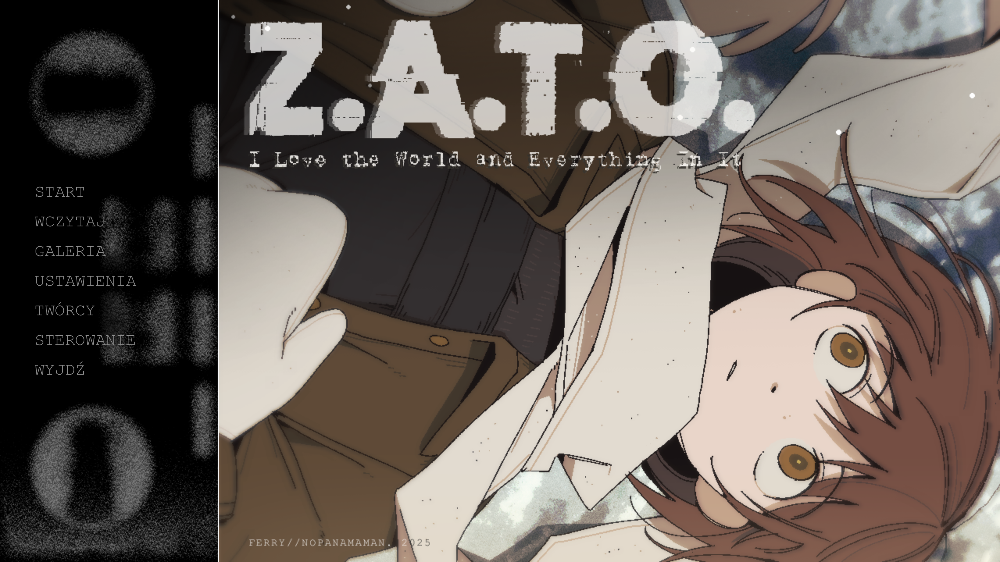
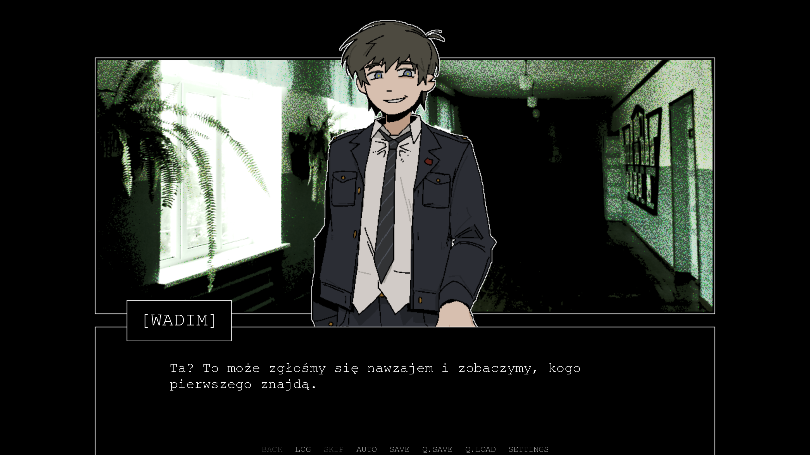
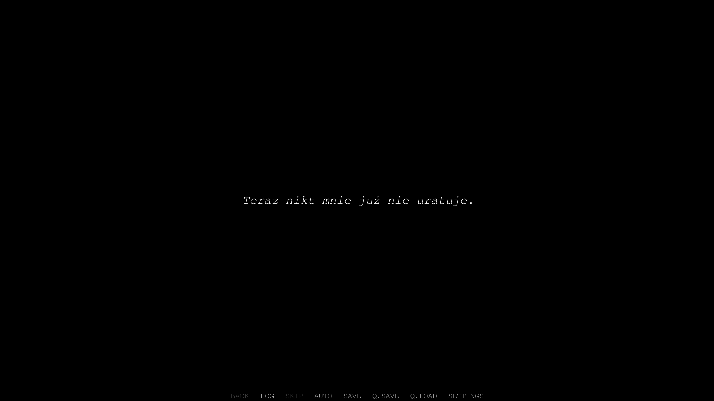
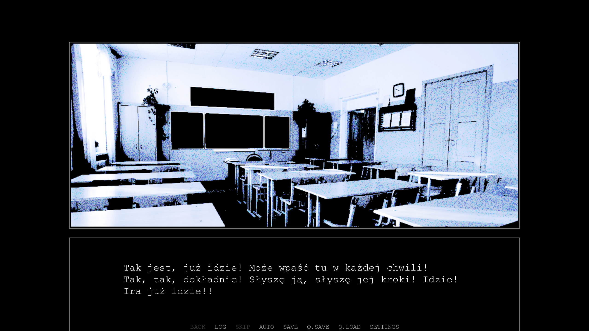
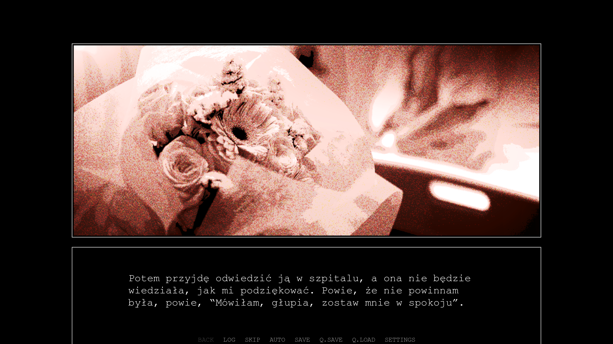
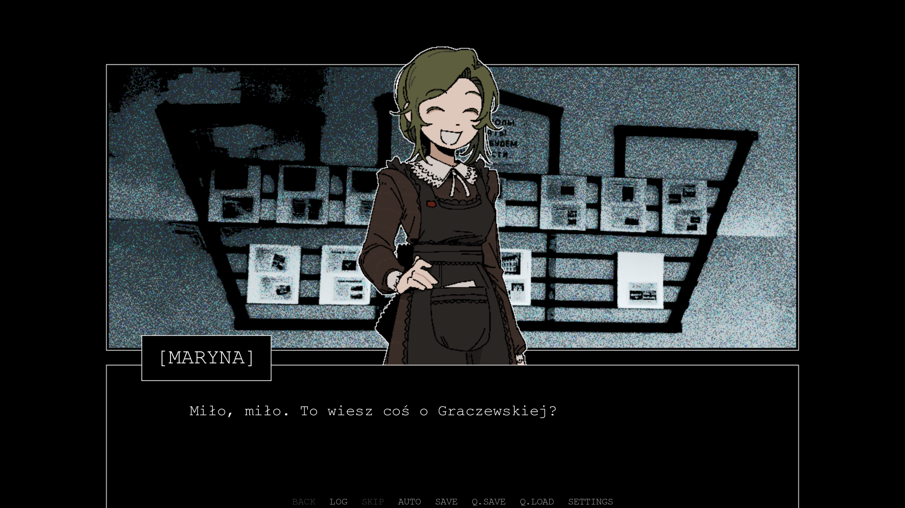
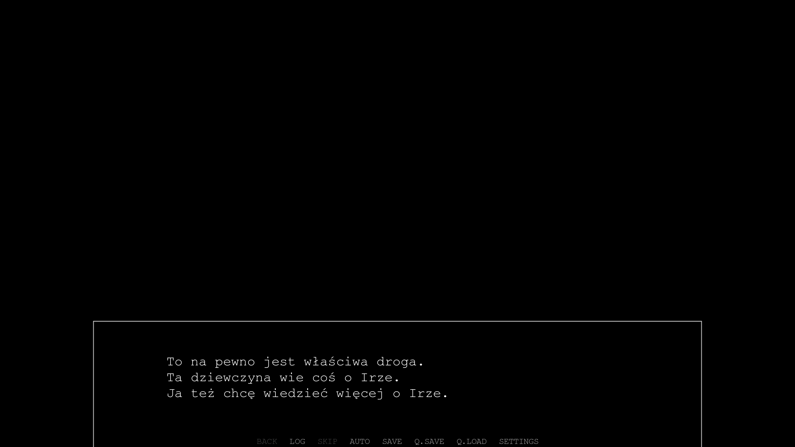

# ZATO_PL
Polish translation for Z.A.T.O // Polskie tłumaczenie Z.A.T.O

||||
|-|-|-|
||||
|| | |

## Installation // Instalacja

Replace (or move for backup) the scripts.rpa file in the /game/ subfolder of the folder containing the game's files (on Steam, right-click the game and select Manage -> Browse Local Files).

Nadpisz (lub przenieś do innego folderu celem stworzenia kopii zapasowej) plik scripts.rpa w podfolderze /game/ głównego folderu gry (na Steamie, kliknij prawym przyciskiem na grę i wybierz Manage -> Browse Local Files).
